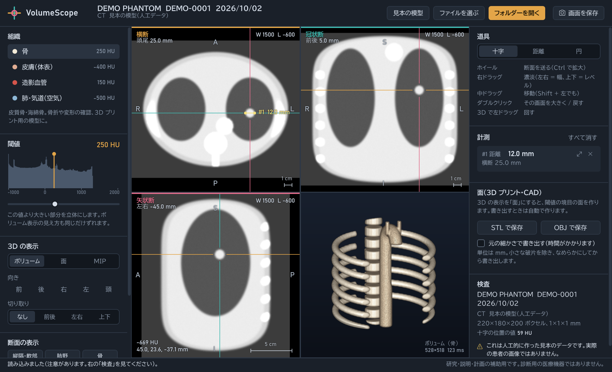
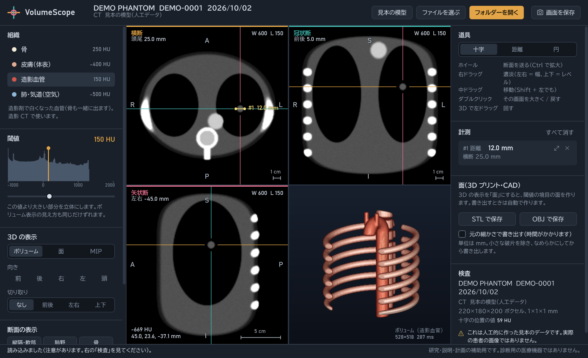
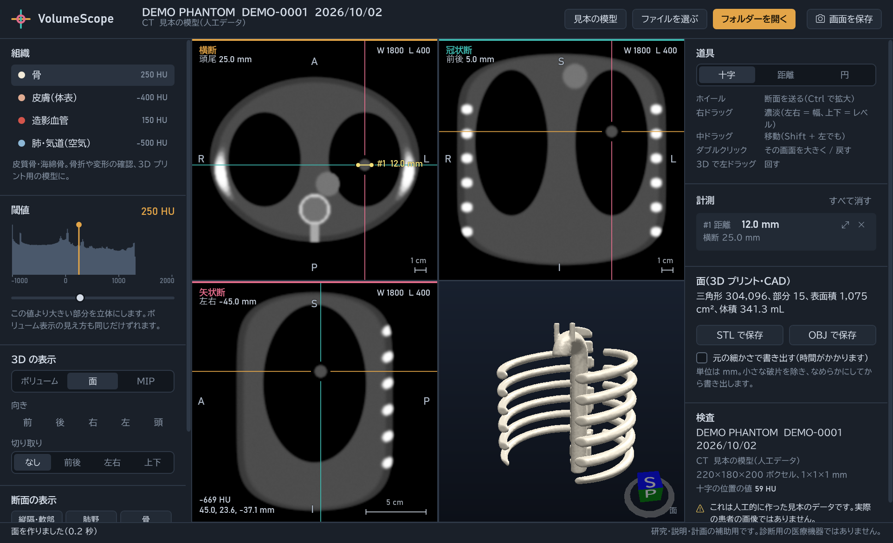
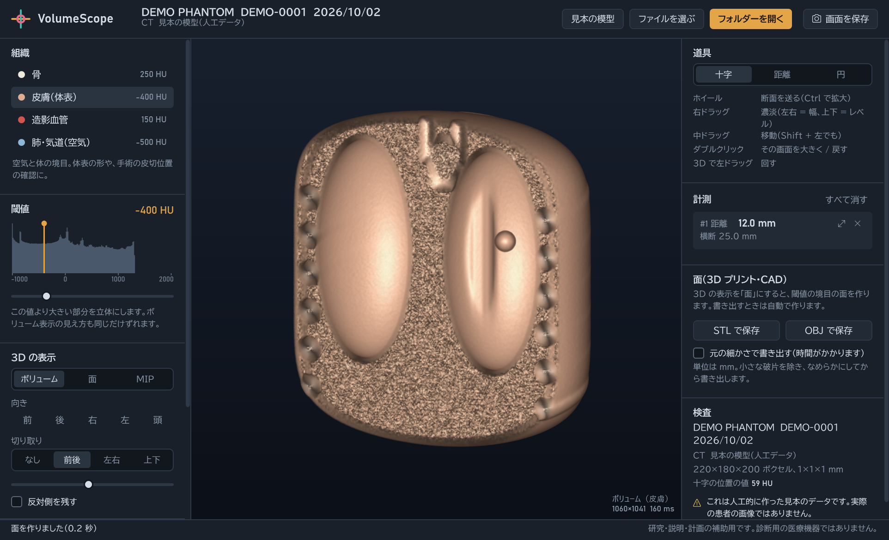
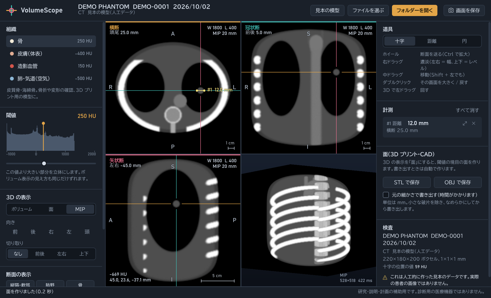
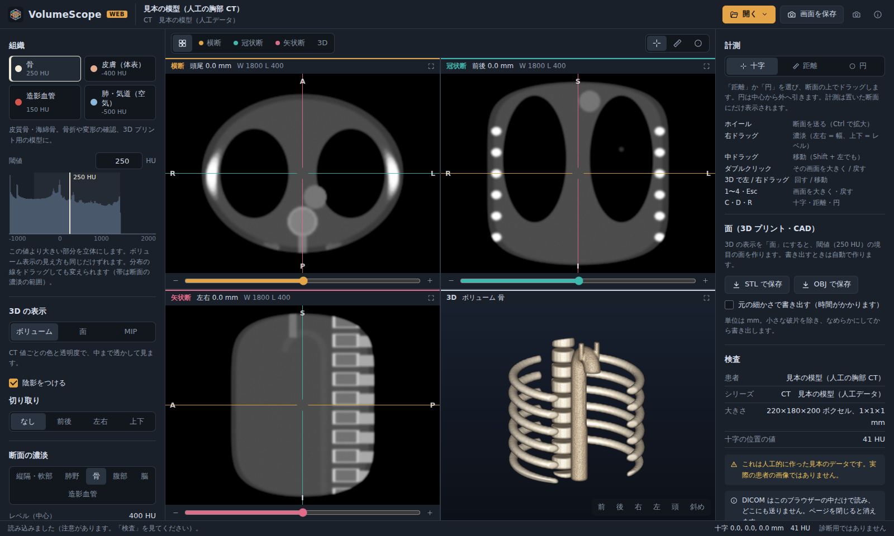
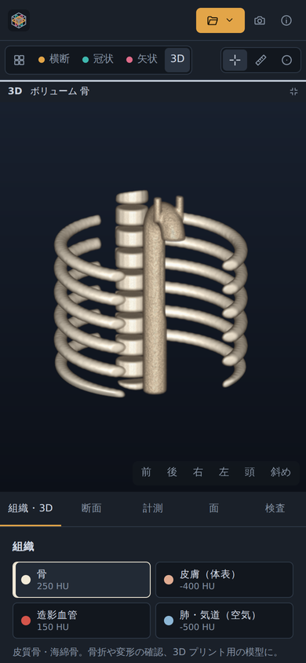

# VolumeScope — CT 3D ワークステーション

CT の DICOM シリーズを読み込み、**3 断面（横断・冠状断・矢状断）と 3D** を並べて表示する Windows アプリです。
骨・皮膚・造影血管・肺の立体表示、距離と CT 値の計測、3D プリント用の STL 書き出しができます。
読影や手術計画の **補助** を想定しています。

**▶ ブラウザーで開く: https://haru-ki417.github.io/VolumeScope/** 　スマホ・タブレット・パソコンで、インストールなしで使えます（DICOM はブラウザーの中だけで読み、どこにも送りません）。

> **診断用の医療機器ではありません。** 医療機器としての承認・認証は受けていません。研究・説明・計画の補助として使ってください。



## できること

| | |
| --- | --- |
| **読み込み** | フォルダーを選ぶかドロップ。シリーズを自動で見分け、位置（Image Position）で並べ替え。位置決め画像・重複を除外。ガントリー傾斜・斜めの断面・頭尾どちら向きの撮影にも対応。圧縮 DICOM（JPEG・JPEG 2000 など）も展開 |
| **3 断面（MPR）** | 患者座標で切り出し（放射線科の向き）。十字の位置が 3 画面で連動。濃淡のプリセット（縦隔・肺野・骨・腹部・脳・造影）と右ドラッグでの調整。厚みのある MIP / 平均 |
| **3D** | ボリュームレンダリング（骨・皮膚・造影血管・肺）、閾値の面、MIP。前後・左右・上下の切り取りで中を見る |
| **組織と閾値** | CT 値の分布（ヒストグラム）を見ながら、線をドラッグして閾値を合わせる |
| **計測** | 2 点間の距離（mm）、円の中の CT 値（平均・SD・最小・最大・面積）。置いた断面へすぐ戻れる |
| **書き出し** | 面を STL / OBJ（mm 単位、破片を除いてなめらかに）、画面を PNG |
| **見本の模型** | 人工の胸部 CT（背骨・肋骨・造影大動脈・肺・直径 12 mm の結節）。データがなくても操作を試せる |

<table>
<tr>
<td></td>
<td></td>
</tr>
<tr><td align="center">造影血管のボリュームレンダリング</td><td align="center">骨の面（STL に書き出せる）</td></tr>
<tr>
<td></td>
<td></td>
</tr>
<tr><td align="center">体表を前後で切り取り、肺の結節を見る</td><td align="center">厚み 20 mm の MIP と 3D の MIP</td></tr>
</table>

画面の色は断面ごとに決めています（横断 = 琥珀、冠状断 = 青緑、矢状断 = ばら色）。ほかの画面に引かれた十字の線も同じ色なので、どの線がどの断面かがすぐ分かります。

## しくみ

すべての計算（読み込み・断面・面・ボリュームレンダリング）は、画面に依存しない `VolumeScope.Core` にあり、Linux の CI でもテストしています。

| 部分 | やり方 |
| --- | --- |
| 3D 化 | 各画像の位置を断面の法線に投影して並べる（Instance Number に頼らない）。スライスの並ぶ向きと間隔は位置から求めるので、ガントリー傾斜でもゆがまない。番地 ⇔ 患者座標はアフィン変換で一般化 |
| 断面 | 患者座標の軸に沿った平面を、三線形補間で切り出す（元の画像が斜めでも正しい向き） |
| 面 | マーチングキューブス法。辺の上の位置を補間し、頂点を共有して穴のない面にする。画像の端も閉じるので体積が求まる。スライス方向に分けて並列に計算し、継ぎ目の頂点をつなぐ。そのあと小さな破片を除き、Taubin の方法でなめらかにする（体積がほとんど縮まない） |
| ボリュームレンダリング | CPU のレイキャスティング（GPU のない PC・仮想環境でも動く）。伝達関数・勾配による陰影・早期打ち切り・8³ ボクセルの塊ごとの最大値で空の領域を飛ばす。操作中は粗く、止めると細かく描き直す |

### テスト（47 件）

- 読み込み: ばらばらの順番・逆向きの撮影・位置決め画像と重複・斜め＋ガントリー傾斜・符号つき 12 bit / 符号なし＋Intercept・位置情報のない古い形式
- 面: 球の体積が理論値の 1% 以内・表面積 2% 以内・オイラー標数 2・**雑音だらけの画像でもすべての辺がちょうど 2 つの三角形に共有される**・画像の端で閉じる・面積ゼロの三角形がない
- 描画: 空の領域を飛ばしても飛ばさない場合と **1 画素も違わない**・向きの慣例（正面から見て患者の右が画面の左）
- 断面・計測・STL/OBJ の形式

### 元の試作からの主な改善

試作（`Medical3DEngine`）の辺の表（EdgeTable）は標準の表と食い違っていて、三角形の頂点の一部が前の立方体の古い位置で作られていました。VolumeScope では辺の表を三角形の表から作り、食い違いが起きないようにしています。ほかに、閾値の固定（200 HU）・4 ボクセルおきの間引き・縦方向の 3 倍の表示倍率（スライス間隔と二重にかかる）もなくしました。

## ブラウザー版（スマホ・タブレット・パソコン）

https://haru-ki417.github.io/VolumeScope/ を開くだけで使えます。Windows 版と同じ計算の部品（`VolumeScope.Core`）を WebAssembly にして、画面だけをブラウザー用に作りました。

<table>
<tr>
<td width="74%"></td>
<td></td>
</tr>
<tr><td align="center">パソコン（4 分割）</td><td align="center">スマホ（1 画面ずつ切りかえ）</td></tr>
</table>

- **読み込み**: フォルダー・複数のファイル・ZIP を選ぶか、画面にドロップ。DICOM はブラウザーの中だけで読み、どこにも送りません
- **3D は GPU（WebGL2）**: Windows 版の CPU のレイキャスティングと同じカメラ・同じ伝達関数（1 HU ごとの表）・同じ勾配の陰影の式を、画素ごとのシェーダーで計算。CT 値は半精度の小数の 3D テクスチャにし、-1024〜3071 HU を 1 HU 単位で保つ。大きな検査は GPU の上限に合わせて 3D の表示だけ縮める（断面・面・計測は元の細かさ）
- **断面・面・計測**: Windows 版と同じ C# の計算（三線形補間の断面、マーチングキューブス法の面、円の CT 値）を、WebAssembly に事前翻訳（AOT）して動かす
- **タッチ操作**: 1 本の指で十字・計測（3D は回す）、2 本の指で拡大・移動、ダブルタップで大きく表示。断面の下のつまみで断面を送る
- 一度開けばオフラインでも起動できます（アプリの部品だけを保存し、DICOM は保存しない）
- 圧縮された DICOM（JPEG・JPEG 2000 など）は、展開の部品がブラウザーで動かないため Windows 版だけで開けます

## 使ってみる

- ブラウザー版: https://haru-ki417.github.io/VolumeScope/
- 配布版: [Releases](../../releases) の zip を展開して `VolumeScope.exe` を起動（.NET のインストール不要）
- データがなければ「見本の模型で試す」
- 実際の CT で試すなら、[The Cancer Imaging Archive (TCIA)](https://www.cancerimagingarchive.net/) などの公開データが使えます。コレクションごとに利用条件（ライセンス・引用のしかた）が違うので、各ページで確認してください。

## 開発

```bash
# .NET 10 SDK
dotnet build VolumeScope.slnx
dotnet test --solution VolumeScope.slnx
dotnet run --project src/VolumeScope.App
dotnet run --project src/VolumeScope.Web      # ブラウザー版（開発用のサーバー）。公開版の作成には `dotnet workload install wasm-tools` が必要

# 見本の模型で画面を一通り開き、画像に保存（docs/screenshots の作り方）
VolumeScope.exe --snapshots docs/screenshots
```

## 制限と今後

- マルチフレーム（Enhanced CT）形式は未対応（スライスごとのファイルなら読める）
- 面の三角形が多いとき（約 150 万以上）は、自動で粗くして表示する。書き出しは「元の細かさ」を選べる
- 計測の値は、画像の Pixel Spacing と位置の情報に基づく。情報が欠けている画像では注意を表示する
- 今後: 斜めの断面（任意の向き）、領域の切り出し（シードからの領域拡張）、DICOM への書き出し

## ライセンス

[MIT](LICENSE)。使っているソフトウェアは [THIRD_PARTY_NOTICES.md](THIRD_PARTY_NOTICES.md)。
